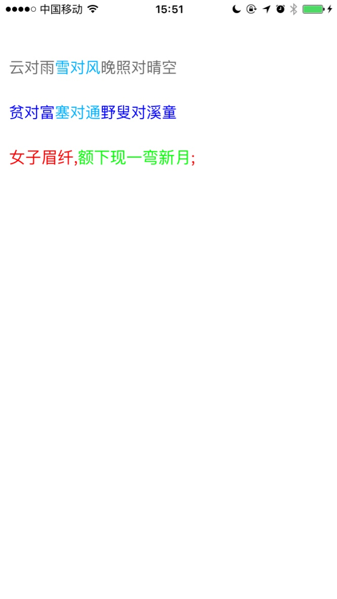

# TextColorFilterTool
 渲染UILabel或者UIButton两种颜色文字
 
1.使用接口：

-(void) setStateNormalColor:(UIColor*) normal StateSelected:(UIColor*)selected;

-(NSMutableAttributedString *) chengesColorText:(NSString*) butedString;

-(UILabel *) chengesColorText:(NSString*) butedString AndUILabel:(UILabel*) control;

-(UIButton *) chengesColorText:(NSString*) butedString AndUIButton:(UIButton*) control forState:(UIControlState) state; 

2.效果： 

